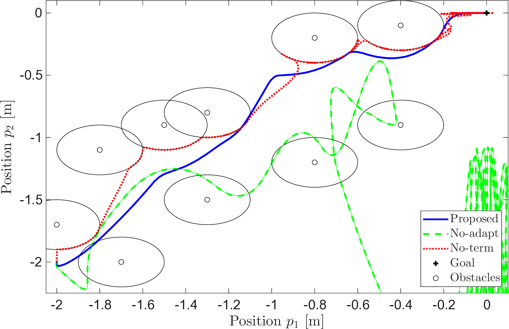

# Adaptive MPC for nonlinear sytems

## Description

This repository contains the MATLAB code that accompanies the paper 
>  Johannes Köhler "Certainty-equivalent adaptive MPC for uncertain nonlinear systems", 2026.

## Prerequisites

- [MATLAB](https://de.mathworks.com/products/matlab.html)  
- [YALMIP](https://yalmip.github.io/)  
- [Mosek](https://www.mosek.com/)  
- [Casdadi](https://web.casadi.org/)  

## Usage
Run `main.m` in either folder to setup the modle, design the MPC, run closed-loop simulations, generate plots and save results. 
Some settings can be changed with booleans in the beginning of code, e.g., to make a short simulation and not simulate some methods that take longer.

